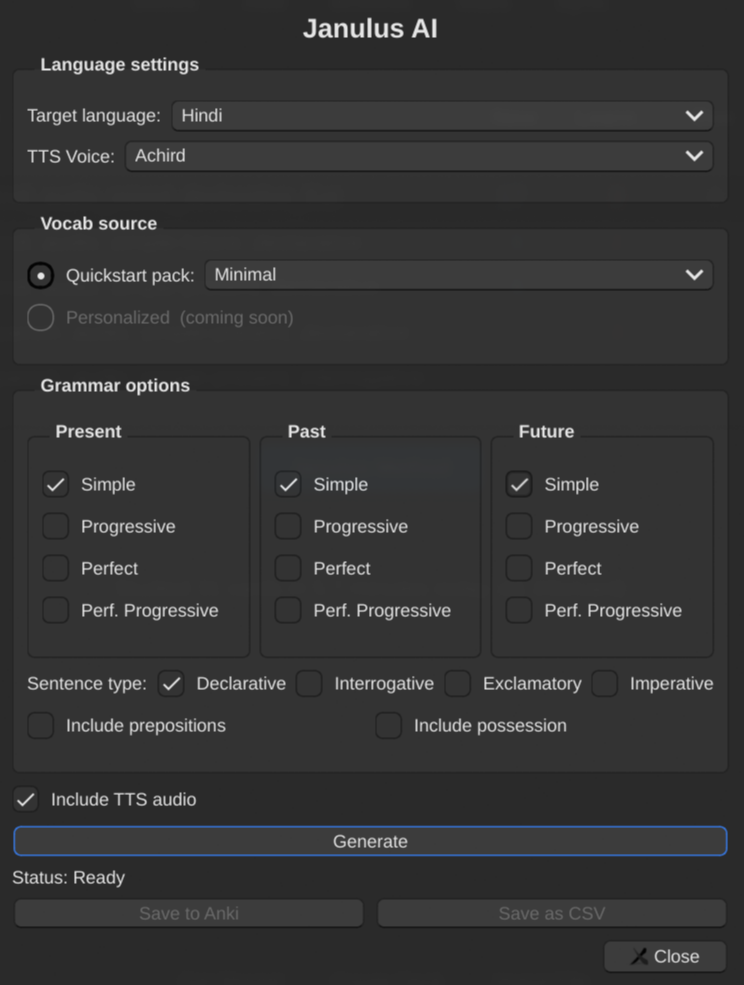

# Janulus AI — Anki Addon

Janulus AI is an Anki addon powered by Google Gemini that generates personalised, grammar-rich sentence cards and gets them straight into your deck. Anki's spaced-repetition algorithm is one of the most effective learning tools ever built — the bottleneck has never been the SRS itself, it's sourcing high-quality, relevant cards. Janulus AI solves that.

## The Janulus Method

The addon is built around the **Janulus Method**, named after **Powell Janulus** — a Canadian polyglot fluent in 48+ languages and a Guinness World Record holder. His approach rests on three pillars: **pronunciation from day one**, **grammar absorbed through context rather than memorised from tables**, and **rapid production of real conversational output**.

The core philosophy: you acquire grammar by encountering it repeatedly inside natural sentences built around vocabulary *you* chose — not by drilling conjugation charts. Janulus AI operationalises this directly. You pick words that matter to you, the AI generates grammatically correct, native-sounding sentences across every tense and sentence type you select, and Anki handles the rest with spaced repetition.



---

## Features

- **11 quickstart vocabulary packs** — Survival Basics, Daily Routine, Shopping & Dining, Self Introduction, Core Pronouns, Interrogatives, and more; ready to use in one click
- **78 supported languages** — from Arabic and Mandarin to Swahili and Welsh
- **12 tenses × 4 sentence types** — combinatorial card generation across Simple / Progressive / Perfect / Perfect-Progressive in Present, Past, and Future, combined with Declarative, Interrogative, Exclamatory, and Imperative forms; dozens of personalised sentences in seconds
- **Optional TTS audio** — 19 Gemini voices via Gemini 2.5 Flash TTS; audio is cached so replays are instant
- **AI validation** — every generated sentence is checked for native-speaker naturalness before entering your deck
- **SQLite cache** — sentences are stored by content hash; re-runs skip generation and validation entirely
- **Export options** — import directly into your Anki collection or save as CSV

---

## Tools Used

| Tool | Role |
|------|------|
| **Google Gemini 2.0 Flash** | Sentence generation and naturalness validation via structured JSON output (`response_json_schema`) |
| **Google Gemini 2.5 Flash TTS** | Audio generation, 19 voices, 78 languages |
| **genanki** | Anki `.apkg` deck creation and direct collection import |
| **SQLAlchemy + SQLite** | Hash-based sentence cache with validation state (`is_valid`: `None` / `True` / `False`) |
| **Python asyncio + Semaphore** | Concurrent generation and validation, capped at 10 parallel requests |
| **Anki addon API (aqt / Qt)** | Native UI dialog integrated into Anki's Tools menu and deck browser |

---

## Why LLMs Instead of Rule-Based Grammar Generation

Traditional rule-based approaches require hand-coded morphology tables, conjugation rules, and agreement logic for every language — they break on irregular verbs, word-order differences, gendered nouns, case systems, and idiomatic phrasing. An LLM trained on billions of native-speaker sentences has internalised all of this implicitly, producing output that is both grammatically correct *and* natural. A second validation pass ("would a native speaker actually say this?") catches any edge cases. The SQLite cache means each sentence is generated and validated only once — subsequent runs are instant.

---

## Getting Started

### Prerequisites

- [Anki](https://apps.ankiweb.net/) (version 23.10 or later recommended)
- A Google Cloud project with the Gemini API enabled
- Two environment variables set in your shell (required for Gemini):

```sh
export GOOGLE_CLOUD_PROJECT="your-project-id"
export GOOGLE_CLOUD_LOCATION="global"
```

- If using ElevenLabs for TTS, also set:

```sh
export ELEVENLABS_API_KEY="your-elevenlabs-api-key"
```

### Installation

1. Copy the `addon/` folder into your Anki addons directory:
   - **Linux / macOS**: `~/.local/share/Anki2/addons21/janulus_ai/`
   - **Windows**: `%APPDATA%\Anki2\addons21\janulus_ai\`
2. Install bundled Python dependencies by running `bundle_deps.sh` from the project root.
3. Restart Anki.

### Configuration

The addon reads its settings from `addon/config.json`. The key options:

| Key | Default | Description |
|-----|---------|-------------|
| `L2` | `"hindi"` | Target language |
| `tts_provider` | `"gemini"` | TTS backend — `"gemini"` or `"elevenlabs"` |
| `tts_voice` | `"Achird"` | Gemini voice name (only used when `tts_provider` is `"gemini"`) |
| `elevenlabs_voice_id` | `""` | ElevenLabs voice ID (only used when `tts_provider` is `"elevenlabs"`) |

To switch to ElevenLabs TTS, set `"tts_provider": "elevenlabs"` and provide a valid `"elevenlabs_voice_id"` in `config.json`. Voice IDs can be found in the [ElevenLabs voice library](https://elevenlabs.io/voice-library). The `ELEVENLABS_API_KEY` environment variable must also be set.

### Quick Walkthrough

1. Open Anki — click the **Janulus Method** button in the deck browser, or go to **Tools → Janulus AI…**
2. Choose your target language and TTS voice.
3. Select a quickstart vocabulary pack.
4. Tick the tenses and sentence types you want.
5. Click **Generate** — sentences are built, validated, and cached.
6. Click **Save to Anki** to import the deck directly, or **Save as CSV** for manual import.
